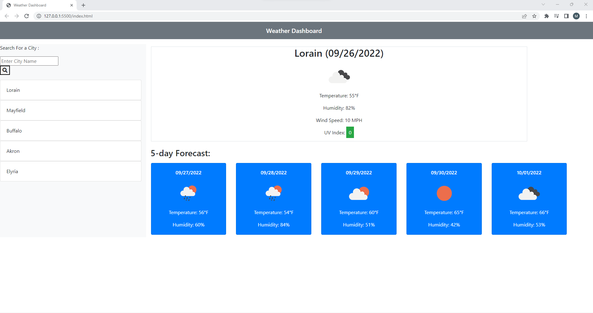

# Weather-Outlook

## Description
- I added a function to load cities and store them
- I added a function to save cities and store them
- I added a function to allow what is searched to appear
- I added a function to show the most current data
- I added a function to show the most recent temperature, humidity, windspeed, etc
- I added a function allowing the color of the background to change depending on seriousness of UV
- I added a loop for the 5 day forecast
- I added a alert system if anything but a city was listed.
### Screenshot

#### URL
https://mhkhalil1.github.io/Weather-Outlook/